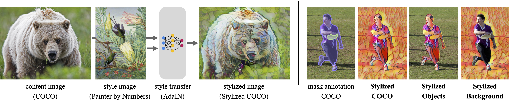

# Trapped in texture bias? A large scale comparison of deep instance segmentation [ECCV 2022]



This is the official code release for the paper *Trapped in texture bias? A large scale comparison of deep instance segmentation*, accepted at ECCV 2022.

- **Paper**: [https://www.ecva.net/papers/eccv_2022/papers_ECCV/papers/136680597.pdf](https://www.ecva.net/papers/eccv_2022/papers_ECCV/papers/136680597.pdf)
- **Supplementary material**: [https://www.ecva.net/papers/eccv_2022/papers_ECCV/papers/136680597-supp.pdf](https://www.ecva.net/papers/eccv_2022/papers_ECCV/papers/136680597-supp.pdf)

Diff to arXiv: Updated related work and discussion, additional ablation: removing object contour.

**If you find our study useful or when using the object-centric datasets, please consider citing as follows:**

```bibtex
@inproceedings{theodoridis2022texturebias,
  title = {Trapped in Texture Bias? A Large Scale Comparison of Deep Instance Segmentation},
  author = {Theodoridis, Johannes and Hofmann, Jessica and Maucher, Johannes and Schilling, Andreas},
  booktitle = {Computer Vision – ECCV 2022: 17th European Conference, Tel Aviv, Israel, October 23–27, 2022, Proceedings, Part VIII},
  url = {https://doi.org/10.1007/978-3-031-20074-8_35}
  keywords = {Texture robustness, Robust vision, Object-centric, Instance segmentation, Out-of-distribution, Deep learning},
  year = {2022}
}
```

## Overview

The code release consists of three parts:

1. An object-centric version of Stylized COCO
2. Detection and evaluation code for 61 models covering *Cascade* and *Mask R-CNN*, *Swin Transformer*, *BMask*, *YOLACT(++)*, *DETR*, *BCNet*, *SOTR* and *SOLOv2*.
3. Data analysis and visualization (to reproduce results and figures)

### Directory structure

- `./datasets` - Stylized COCO will be created in this directory and the detection code assumes it to be there (configurable in `path_config.json`).
- `./detections` - Detection and evaluation files will be saved in this directory (configurable in `path_config.json`). NOTE: running 61 models on 60 copies of COCO val2017 will result in ~1TB of uncompressed data. If you are interested in custom evaluation and additional analysis please reach out to us.
- `./plots` - Figures from the analysis will be saved here.
- `./ext` - A central point to install detection frameworks and other required dependencies (we will release detailed installation instructions over the next weeks).
- `./src` - Source code to create datasets, run detections, evaluation, analysis and visualization.

## 1. An object-centric version of Stylized COCO

> **You can download Stylized COCO (●), Stylized Objects (▲) and Stylized Background (■) as used in the study from [here](https://drive.google.com/drive/folders/1NNX8oaxr--PUUYdH7pfJiNwkQ9zGkY0E).**

Every dataset version contains 20 accordingly styled copies of the COCO val2017 subset (11 blending steps in feature space + 9 in pixel space). Note that pixel space blending step 0.0 is the original COCO val2017 subset and not included. Pixel space blending step 1.0 is equivalent to feature space 1.0 and therefore, not included either (would be a doubling of data). For convenience, we added annotations/instances_val2017.json to every dataset version (it's just a copy of original COCO annotations).

### How it's made:

We use a [slightly modified version](https://github.com/JohannesTheo/stylize-datasets) of [stylize-datasets](https://github.com/bethgelab/stylize-datasets) to create Stylized COCO. It allows us to fix the choice of style images ([pull request pending](https://github.com/bethgelab/stylize-datasets/pull/18)). The random but fixed style maps can be found in `./datasets/coco_style_maps/`. We use `coco_style_map_1.json` in all of our experiments (the data in Google Drive was generated with these styles). The code in `./src/datasets/` can be used to create the blending sequences of Stylized COCO and the object-centric versions Stylized Objects and Stylized Background.

To generate the data yourself follow the steps below. Note that this will produced 60 copies of the COCO val2017 subset (~15GB in total).

```bash
# 1 - get the code
git clone https://github.com/JohannesTheo/trapped-in-texture-bias.git
cd trapped-in-texture-bias
git clone https://github.com/JohannesTheo/stylize-datasets.git ./ext/stylize-datasets

# 2 - create a conda environment to generate the dataset versions
conda create --name stylized-coco python=3.8
conda activate stylized-coco
conda install pytorch==1.8.1 torchvision==0.9.1 cudatoolkit=10.2 requests==2.25.1 tqdm==4.59.0 -c pytorch
pip install pycocotools

# 3 - get the data 
# Data has to be placed in/will be downloaded to: trapped-in-texture-bias/datasets
# If you prefer a different directory, adjust the settings in trapped-in-texture-bias/path_config.json

# 3.1 coco val2017
cd src/datasets/
python download_coco.py

# If you download coco manually, ensure the following directory structure:
# ls trapped-in-texture-bias/datasets/coco
# > annotations  val2017

# 3.2 style images: https://www.kaggle.com/c/painter-by-numbers/data?select=train.zip
python download_style_images.py -h

# If you prefer to download the style images manually, create the following directory structure:
# trapped-in-texture-bias/datasets/style_images/train

# 4 - get the style weights
python download_style_weights.py

# 5 - generate the data
# The following steps have to be executed sequentially!

# 5.1 create stylized COCO (feature_space)
python stylize_coco.py

# 5.2 alpha blending with original COCO in 10% steps (pixel_space)
python alphablending_coco.py

# 5.3 create stylized objects & background
python masking_coco.py

# Now you should have:
#
# trapped-in-texture-bias/datasets/
#   stylized_coco
#   stylized_coco_background
#   stylized_coco_objects
#
```

## 2. Detection and evaluation

To run the detection on Stylized COCO and the object-centric variants, every framework has to be installed in `./ext`. Please refer to the corresponding projects respectively. The code in `./src/detection` runs the actual detection and evaluation per framework on all 61 datasets (including the original val2017 subset).

Detection results and evaluation files will be saved in `./detections`. Note that we use the [official coco API](https://github.com/cocodataset/cocoapi/tree/master/PythonAPI/pycocotools) for consistency (some projects such as detectron provide optimized but custom coco evaluation code)

## 3. Data analysis and visualization

The code for the analysis and visualization can be found in `./src/analysis`. This is the most *researchy* part of our code release. Please reach out if something is unclear.
